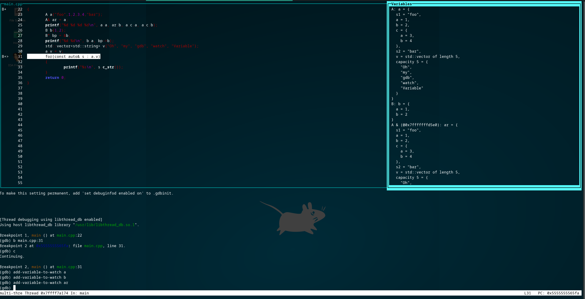

# GDB Watch Variable Window
This python script adds a new window containing variables to watch when debugging a program under GDB. 




# How to install
Clone this repository and add the following line into your ~/.gdbinit (or ~/.gdbrc) file

```
source <pathToThisRepo>/watchVariable.py
source <pathToThisRepo>/watchRegisters.py
tui new-layout watchVariable {-horizontal src 2 watchVariable 1} 2 cmd 1 status 1
tui new-layout watchRegisters {-horizontal asm 2 watchRegisters 1} 2 cmd 1 status 1
layout watchVariable
```

The python script is adding one new TUI window type and 2 user commands `add-variable-to-watch`, `remove-variable-to-watch` (see below)

# How to use
When starting GDB, the layout of the debugger should ressemble to the screenshot (unless you have omited the `layout watchVariable` line).

To add a new variable to watch, use the command `add-variable-to-watch`. The new variable will appear in the `Variables` window.

To remove a variable to watch, use the command `remove-variable-to-watch`.

Switch from variable view to CPU register by using the command
```
layout watchRegisters
layout watchVariable
```

# Tips and tricks
By default, gdb outputs all the numbers in decimal mode. Use the command `set output-radix 16` to print all the variables in the watcher in hexadecimal.
